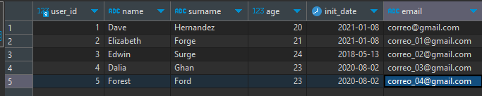

# SQL_Practice
 
Practicing SQL commands, functions, etc.

### DATABASE
I created a Database using Docker that is based on the Postgres:latest image.

The name of the database is **"mydb"** with a table named **"users"**, it is structured like this:
